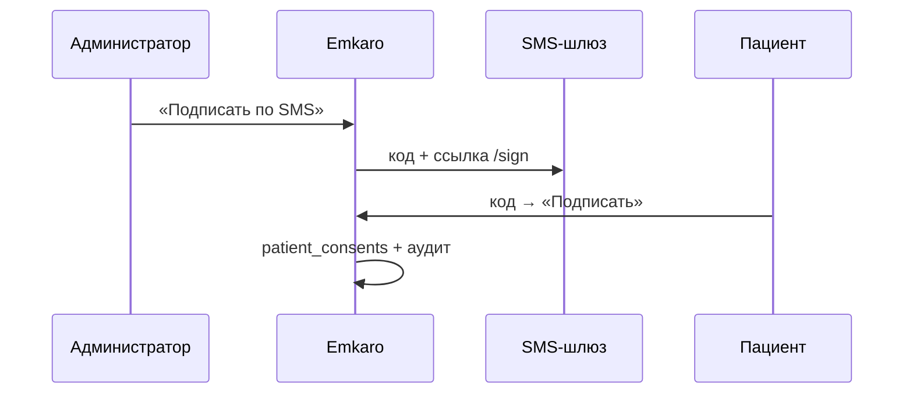

# Подпись документов пациентом

Режимы (`DOCUMENT_SIGN_PROVIDER`):

| Режим | SMS | Где подписывает пациент |
|-------|-----|-------------------------|
| **emkaro** | МИС (свой шлюз) + OTP на `/sign` | страница Emkaro `/sign` |
| **emkaro_sign** | **только** Emkaro Sign (SMS.ru / messaging gateway) | портал Sign |
| **fdoc** | F.Doc | F.Doc |

## Схема Emkaro (свой SMS)



```env
DOCUMENT_SIGN_PROVIDER=emkaro
APP_PUBLIC_BASE_URL=https://ваш-поддомен.emkaro.ru
NOTIFICATIONS_SMS_API_URL=…
NOTIFICATIONS_SMS_API_KEY=…
NOTIFICATIONS_SMS_SENDER=Emkaro
```

Миграции: `015`–`017`.

## Режим Emkaro Sign (`DOCUMENT_SIGN_PROVIDER=emkaro_sign`)

См. актуальный поток с **ручной SMS с телефона клиники**: [EMKARO_SIGN_INTEGRATION.md](./EMKARO_SIGN_INTEGRATION.md), [CLINIC_SMS_SENDER.md](./CLINIC_SMS_SENDER.md).

МИС **не** является SMS-провайдером. Sign возвращает `smsText` + `publicSignUrl`; сотрудник отправляет SMS сам.

### Env МИС

```env
DOCUMENT_SIGN_PROVIDER=emkaro_sign
EMKARO_SIGN_API_URL=http://localhost:43123
EMKARO_SIGN_API_KEY=dev-integration-api-key
EMKARO_SIGN_WEBHOOK_SECRET=…
EMKARO_SIGN_TENANT_MAP={"tstom":{"organizationId":"…","clinicId":"…"}}
```

Миграции: `015`–`018`.

### delivery-destination

По-прежнему доступен для Sign (если Sign запрашивает номер). В режиме clinic-device основной путь SMS — задача на телефон клиники.

## Компоненты

| Что | Где |
|-----|-----|
| Отправка | `lib/document-sign/send.server.ts` |
| Клиент Sign | `lib/document-sign/emkaro-sign/` |
| Номер для SMS | `/api/internal/patients/delivery-destination` |
| Webhook | `/api/webhooks/emkaro-sign` |
| UI | `appointment-documents-modal.tsx` |
| Свой `/sign` | только режим `emkaro` |

## Чеклист

- [ ] Модуль `document_sign` в супер-админке
- [ ] Миграции 015–017
- [ ] При `emkaro_sign`: URL/ключ + tenant map; SMS из МИС нет
- [ ] `EMKARO_URL` в Sign → МИС
- [ ] Телефон в карточке пациента
- [ ] ИДС не уходит в SMS-пакет
