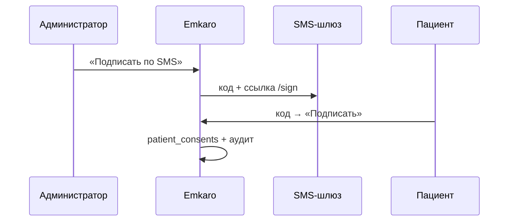

# Подпись документов пациентом

Два режима (переключатель `DOCUMENT_SIGN_PROVIDER`):

| Режим | Документация |
|-------|----------------|
| **Emkaro** — свой SMS + `/sign` (ПЭП) | этот файл |
| **F.Doc** — REST API + SMS от F.Doc | [FDOC-INTEGRATION.md](./FDOC-INTEGRATION.md) |

## Схема Emkaro (по умолчанию)



## Настройка Emkaro

```env
DOCUMENT_SIGN_PROVIDER=emkaro
APP_PUBLIC_BASE_URL=https://ваш-поддомен.emkaro.ru
NOTIFICATIONS_SMS_API_URL=…
NOTIFICATIONS_SMS_API_KEY=…
NOTIFICATIONS_SMS_SENDER=Emkaro
```

Миграции: `015`, `016` — `npm run db:init` или `--migrations-only` на сервере.

## Компоненты

| Что | Где |
|-----|-----|
| Отправка | `lib/document-sign/send.server.ts` |
| OTP / токен | `lib/document-sign/otp.server.ts`, `token.server.ts` |
| API | `/api/document-sign/*` |
| UI | `appointment-documents-modal.tsx` |
| Страница пациента | `/sign` |

## Чеклист

- [ ] SMS-шлюз или F.Doc (см. FDOC-INTEGRATION.md)
- [ ] Миграции 015–016
- [ ] `APP_PUBLIC_BASE_URL`
- [ ] Телефон пациента
- [ ] Текст `/sign` согласован с юристом
